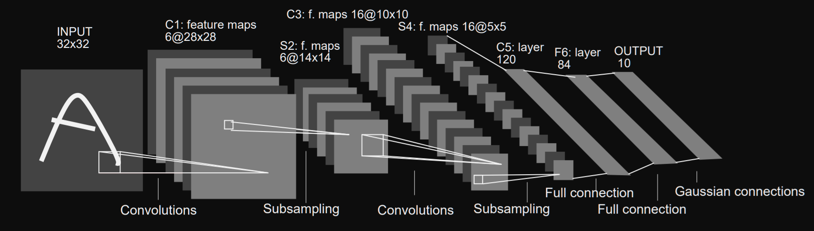

# cuda-project : Implementation LeNet-5

> LeNet is a convolutional neural network structure proposed by Yann LeCun et al.
> in 1989. In general, LeNet refers to LeNet-5 and is a simple convolutional neural network.
> Convolutional neural networks are a kind of feed-forward neural network whose artificial 
> neurons can respond to a part of the surrounding cells in the coverage range and perform 
> well in large-scale image processing.
> https://en.wikipedia.org/wiki/LeNet

## Elementary operation 

In [`hsp1.cu`] there are all the elementary operations from Matrix addition on CPU/GPU, Matrix Multiplication on CPU/GPU, and Convolution2D on GPU.

To compare the speed difference between GPU and CPU implementation, I used my laptop which has an RTX2060 and Intel i7-9750H, see [`CUDA_device_spec.png`] for more information.

For matrix Addition of size 10000*10000 : TimeCPU = 14.49 seconds, Time_GPU = 0.44 seconds (with 1024 threads and 10 blocks)
For matrix Multiplication of size 3200*3200 : TimeCPU = 226.258 seconds, Time_GPU = 0.298 seconds (33 times faster)
For matrix Multiplication of size 20000*20000 : Time_GPU = 0.57 seconds, and for matrix Multiplication of size 28000*28000 Time_GPU = 7.2 seconds
The speed is not impacted when changing the number of gridDim and blockDim (or very little change).

## LeNet-5

